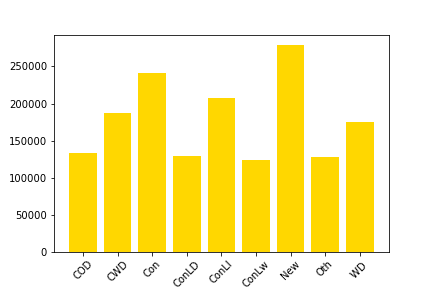

# Project 2 - Ames Housing Data and Kaggle Challenge

## PROBLEM STATEMENT

### Inferring or Predicting? What's more valuable for a housing model?

**When creating a linear regression model, what's the most important task for that model?** 

Is it being able to make inferrences on the features and the underlying process? Or is it the actual prediction itself regardless of the assumptions? Is it something in between?

The audience in this case is a group of semi-technical stakeholders at a real-estate company wondering how best to create their linear regression model, and which direction they should lean towards.

Success is determined by the variation in models created and whether the model that I end up creating and presenting manages to be both inferrable and a good determinant for future predictions.

This is important to investigate because ultimately, the balance between predictive value and inferrence based value is one that many new to linear regression to struggle with as they often feel as if it's a choice between one or the other. This is evidenced by the variety (and popularity) of ways to transform your model to better achieve a balance between both.

I realize that the audience will be semi-technical but in this context where I'm presenting the best model to those high up in the company not just those in the data science team that I am on, I must present my findings and model in layman's terms while explaining what the linear regression assumptions are.

"All models are wrong, but some are useful" - George EP Box

## DATA CLEANING AND EDA

### Integer Columns
When first looking at the data provided to me, I had to look at the correlation coefficients of the initial integer columns to get a good sense of what exactly would I be initially working with and subsequently cleaning the columns by placing them in different sub dataframes depending on their **correlation coefficients**  

This cleaning phase was included in following cleaned datasets but after this stage, I created a CSV with this stage by itself for both test and train. Labelled [`test_integer_cols_clean.csv`](./created_datasets/test_integer_cols_clean.csv) and [`train_integer_cols_clean.csv`](./created_datasets/train_integer_cols_clean.csv)
### Converting Objects into Indices
I then proceeded to focus my efforts on converting object columns that could otherwise be integers into integers. So the primary criteria for this would be columns that fell under the quality, condition, or exposure name. The reason being that these columns while on the surface being objects, could easily be converted to integers considering they are a measurement of some kind.

The way I converted these columns was primarily with this function but I also had different variations depending on how the column measured quality.

```
def gar_convert(x):
    if x == 'Ex':
        return 5
    elif x == 'Gd':
        return 4
    elif x == 'TA':
        return 3
    elif x == 'Fa':
        return 2
    elif x == 'Po':
        return 1
    elif x not in vcgarage:
        return 0
```

This function (and it's variations) allowed me to easily get rid of nulls while also turning the columns into indices.

This cleaning phase was included in following cleaned datasets but after this stage, I created a CSV with this stage by itself and the previous stages for both test and train. Labelled [`test_indice_cols_clean.csv`](./created_datasets/test_indice_cols_clean.csv) and [`train_indice_cols_clean.csv`](./created_datasets/train_indice_cols_clean.csv)
### Additional Data Exploration
The rest of the data cleaning and EDA process with the dataset primarily involved me looking at object columns and creating new columns from that highlight a specific grouping of categories or a specific category itself by listing rows that had that/those specific value/values as 1 and that/those that didn't as 0 in the new column. Similar to One Hot Encoding but creating a new column rather than replacing the old. An example of the code used to obtain the new graph and create the new column would be
```
plt.bar(sorted(train['Sale_Type'].unique()),
              train.groupby('Sale_Type')['SalePrice'].mean(), color ='gold')
plt.xticks(rotation = 45);

traindummy['Sale_Type_Is_New'] = (traindummy['Sale_Type'] == 'New').astype(int)
traindummy.head()
```
The "traindummy.head()" was for sanity checking to see if the code actually worked, the graph made was for additional information necessary to create those columns alongside with the descriptive statistics gained from the function value_counts. For example; the graph referenced previously. **Graph in question** 

This cleaning phase was included in following cleaned datasets but after this stage, I created a CSV with this stage by itself and the previous stages for both test and train. Labelled [`test_clean.csv`](./created_datasets/test_clean.csv) and [`train_clean.csv`](./created_datasets/train_clean.csv)

## MODEL CREATION

### Initial Feature Creation
In my first notebook created, I was going for full predictive power and at this time, I only had the indice_cols_clean datasets available so I had to make do without my additional columns from the fully clean datasets. Going for full predictive power, meant for me personally, using a lot of the tools available to me at the time to create the best predictive model possible regardless of the actual assumptions that the Linear Regression model was based on. This mean't heavily collinear and autocorrelated variables.

Eventually, I did end up creating an extremely powerful model at the time of creation that still ranks in the top 5 (as of 11/4/21) of the current Kaggle leaderboards. While it may seem as if this might be the best model for use, it's hard to really gather any inferrences from it considering it violates numerous assumptions that the LR (Linear Regression) model has. 

While having really good metric scores, this model is extremely overfit and it's not homoscedastic whatsoever and the use of Ridge did not help tremendously with my model and same goes with Lasso. I understood the relevance of my features a little better but I was still lost for trying to improve the performance of my model from the features given. The model just doesn't work when you're trying to figure out how exactly a house is valued and what goes into the sale price of a house. The variance was just much too high to actually make conclusions as to what makes a sale price.


### Improved Feature Creation
In the second notebook I made, I put the assumptions over the predictive power but still placed heavy emphasis on getting high metric scores and having high test scores when doing the train/test split. This notebook had access to the fully cleaned columns from the final stage of EDA and cleaning which led to improved feature creation.

In this notebook, I emphasized self-created interaction terms made based on domain-knowledge in my feature creation to transform variables without needing polynomial and the mass amount of features it creates. Using the additional columns from the fully cleaned dataset and the interaction terms, I was able to make a model with limited assumption violations while still maintaining a relatively high test score and RMSE. It scales well not only with the train/test splits but proved immensely effective with a more gaussian spread when using power-transform on the Y-variable (SalePrice).

While there are outliers and some variables are autocorrelated, it's a small portion of the actual independent variables. When looking at my model though, its clear that even though the residuals have quite a bit of variance towards the higher end of houses. In a perfect world, I would be able to have my features obey the assumptions without sacrificing any of the metric scores I had.

I was able to make a homoscedastic model with slight variance towards high-valued houses that was slightly over-fit, this was with high metric scores and better scores with a more Gaussian y-variable (via power transform). It predicts well specifically to more normalized spreads of saleprices, the only thing left to improve is reducing autocorrelation to make better inferred values, more honest metric scores, and reduce variability.


### Assumption Strict Feature Creation
This model if I had more time to fine-tune and get ready, would probably be my preferred model if I could do additional feature creation to create and append new interaction terms to the feature list but sadly, I could not. I firmly believe that I would be able to create a great predictive model that managed to follow all the assumptions of a linear regression model if I had additional time.

In the second notebook, despite the low metric scores, I was impressed at the relative closeness of the residuals and the predictions when in the previous model, the differences were quite stark. Outside of that though, it still suffers from high variability towards higher valued houses and the outliers are actually even more common and spread to the middle of the scatterplot which usually indicate lackluster features being utilized.

A transform would not have made this model incredibly better, it'd still be weak in comparison to the other two but the fact it adheres to the assumptions and doesn't violate them is great. Homoscedasticity is there in the model although paling in comparison to the second model.

This is definitely a model where I have more regrets than I do actual praise. It's much too underfit and suffers from high variance while having a little bias which is never a good recipe in terms of both predictive value and inferrence value.


## CONCLUSIONS
At the end of the day, it depends on what we want and what we're able to do with the time given. But from the data available and what I was able to gather, toeing the line between overfitting and breaking assumptions with maintaining a strict adherence to the assumptions seems like a good mindset when approaching housing data, more specifically this dataset in particular. 

While it's easy to pick a side and be dogmatic, ultimately as data scientists we tell the story how the data wants it to be told and if we are able to get the most information from breaking some assumptions in order to get the best results in the time available.

Those "best results" in my eyes, would be a model that diligently adheres to the assumptions while maintaining high metric scores without variability. If you can do that, than predictibility is second to the amount of inferred data that would become available to you from that. Predictions are nice but ultimately, you can't gather any inferrences and trend data from a regression model that breaks assumptions without rigorous training data that proves the overfitting is conducive to success on unseen data.

Remember, all models are wrong but some are useful.

## SOURCES
["All models are wrong"](https://en.wikipedia.org/wiki/All_models_are_wrong)
[Correlation coefficient information](https://www.andrews.edu/~calkins/math/edrm611/edrm05.htm)
[List of Linear Regression assumptions](https://www.statisticssolutions.com/free-resources/directory-of-statistical-analyses/assumptions-of-linear-regression/)
[Autocorrelation help](https://stats.stackexchange.com/questions/49265/whats-the-deal-with-autocorrelation)
[PowerTransformer](https://scikitlearn.org/stable/modules/generated/sklearn.preprocessing.PowerTransformer.html#sklearn.preprocessing.PowerTransformer.fit_transform)
[Multicollinearity](https://www.statisticssolutions.com/multicollinearity/)
[Homoscedasticity](https://www.statisticssolutions.com/free-resources/directory-of-statistical-analyses/homoscedasticity/)
[Detecting Multicollinearity](https://www.geeksforgeeks.org/detecting-multicollinearity-with-vif-python/)
[Detecting Autocorrelation](https://www.geeksforgeeks.org/autocorrelation/)